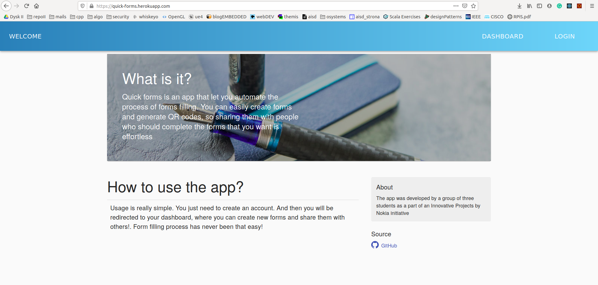

# Quick Forms [](https://travis-ci.com/nokia-wroclaw/innovativeproject-quick-forms)


>Application that provides automation of filling forms process.


Web app is served here: [https://quick-forms.herokuapp.com/](https://quick-forms.herokuapp.com/)

Originally developed by [Dawid Motak](https://github.com/Motii1), [Krystian Sańczyk](https://github.com/nlins8224), [Szymon Pielat](https://github.com/Mateque89) as a part of Innovative Projects by Nokia initiative.



## Table of contents

* [The idea](#the-idea)
* [Features overview](#features-overview)
* [Usage](#usage)

## The idea

Quick forms is an app that let you automate the process of forms filling. You can easily create forms and generate QR codes, so sharing them with people who should complete the forms that you want is effortless.

### Project goals

With this application you get the ability to create your own forms, share it with QR code or short link. The project is mainly directed to the polish offices where filling paper forms process is slow, but with the app they can make it easy, convenient and fast. Of course the problem is not only about polish offices. It occurs at the various sports events as well. 

### Technologies

It's a web application with the front-end structured with React and the back-end made in NodeJS.

## Usage

### Deployment

In our case the application is fully deployed on cloud application platform called Heroku. Although its performance possibilities are quite limited, that way the Quick Forms App has been made available for users all over the world without the need for hosting it on some kind of private server.

[Quick Forms](https://quick-forms.herokuapp.com)

The continuous integration between consecutive commits is provided by the Travis CI. It makes the development management more pleasant and easy to have control of.

What is more every merge to master branch performes automatic deployment through heroku container registry. In the effect whole development process becomes even more simple.

### Local setup

Running the app locallly is not complicated.

All the things that have to be done between the preparation of some new feature and seeing it fully functioning locally are:
```
cd ui
npm install && npm start
cd ../api
npm install && npm start
```

